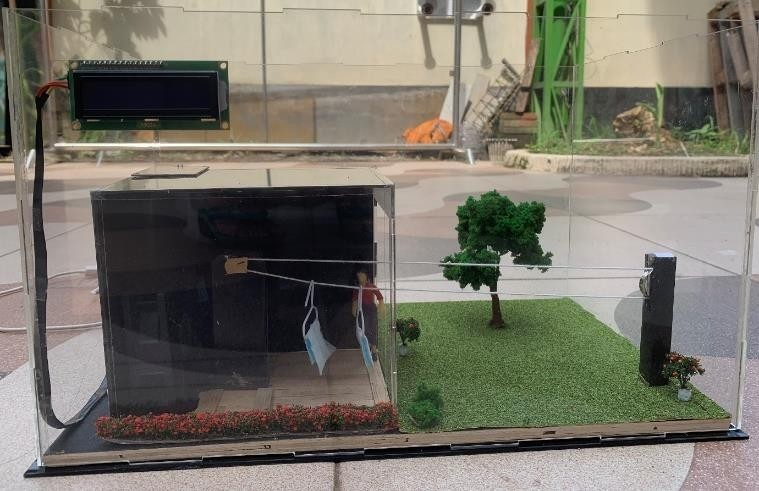
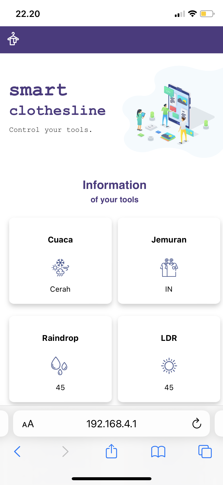
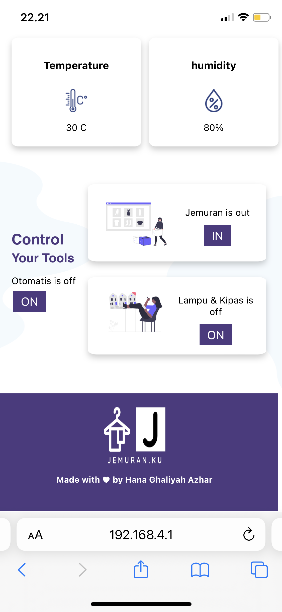

# Tugas Akhir
- Nama: Hana Ghaliyah Azhar
- Bidang: Internet of Things

### Rancang Bangun Prototype Pengendali Jemuran dan Pengering Pakaian Berbasis IoT menggunakan Web Server sebagai Pengontrol
Sistem ini menggunakan `NodeMCU ESP32' dan sensor yang digunakan yaitu sensor raindrop untuk mendeteksi curah air hujan, sensor LDR untuk mendeteksi cahaya matahari dan sensor DHT11 untuk membaca suhu dan kelembaban lingkungan. Untuk komponen yang digunakan terdiri dari motor stepper untuk memindahkan pakaian yang ada di luar ke dalam ruangan, kipas dan lampu pengering untuk mengeringkan pakaian di dalam ruangan. Sistem ini dilengkapi alat pengendali jemuran jarak jauh berupa web yang dapat mengendalikan, memerintah dan mengatur keadaan dari suatu sistem. Untuk alat pengontrolnya sendiri menggunakan Web Server yang merupakan bawaan dari ESP32 dan dapat diakses melalui jaringan lokal. Pada sistem ini, input nilai yang didapat dari 2 (dua) sensor yaitu raindrop dan LDR akan diolah menggunakan metode logika fuzzy. Output dari metode fuzzy yaitu cuaca yang digunakan untuk menentukan keluar masuknya roll atau tali jemuran yang menggunakan bantuan motor stepper sebagai penggerak.

#### 1. Rancangan blok diagram sistem
Tujuan dari perancangan blok diagram sistem ini adalah untuk memudahkan dalam membuat dan merancang alat secara keseluruhan.

#### 2. Perancangan ESP32 sebagai access point

 
Penjelasan:
1.	Server ESP32 membuat jaringan nirkabelnya sendiri yaitu ESP32 Soft-Access Point. Jadi, perangkat Wi-Fi lain dapat terhubung ke jaringan ini (SSID: ESP32-Access-Point, Password: 123456789).
2.	Klien handphone dan laptop diatur sebagai station. Jadi, dapat terhubung ke jaringan nirkabel server ESP32.
3.	Klien dapat membuat permintaan HTTP GET ke server untuk meminta data sensor atau informasi lainnya dan melakukan kontrol terhadap alat. Hal tersebut dapat dilakukan dengan menggunakan alamat IP server untuk membuat permintaan.
4.	Server mendengarkan permintaan yang masuk dan mengirimkan respons yang sesuai dengan pembacaan.
5.	Klien menerima bacaan yang ditampilkan pada web server.

#### 3. Skematik Alat

#### 4. Implementasi
a. Alat
 

 
 
b. Web Server
 

